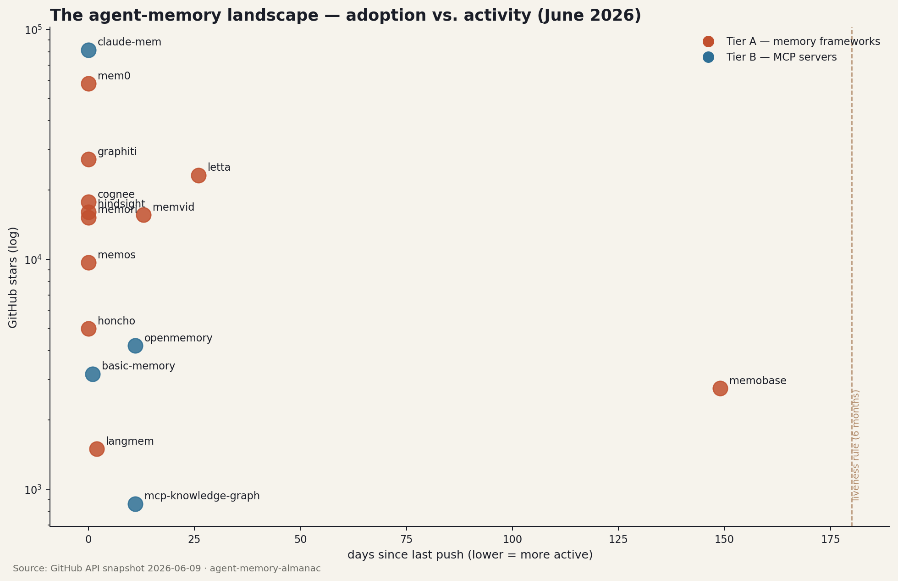

# The Agent Memory Almanac

A living encyclopedia of open-source AI memory tools — the systems that let agents
remember across sessions. Updated **monthly** with fresh repo metadata, releases,
landscape shifts, and (as they land) independent benchmark results from the
*"Platform Engineer's Quest for the Best"* series.

> Vendors publish their own benchmark numbers. Nobody reproduces them independently,
> and nobody evaluates memory tools the way a platform engineer has to live with them:
> ops burden, failure modes, scale curves, and cost. This almanac is the public record
> of that work.

## How to use this repo

| You want… | Go to |
|-----------|-------|
| The state of the landscape right now | The latest file in [`editions/`](editions/) |
| Everything we know about one tool | [`tools/<name>.md`](tools/) |
| Machine-readable roster + metadata | [`data/`](data/) |
| Architecture diagrams + latency charts | [`architecture.md`](architecture.md) |
| Benchmark results (rolling) | [`benchmarks/`](benchmarks/) |
| How tools are tested and ranked | [`methodology.md`](methodology.md) |
| Vendor claims vs. independent reproduction | [`published-vs-reproduced.md`](published-vs-reproduced.md) |
| The benchmark harness code | [`harness/`](harness/) |

## The roster

**Tier A — agent memory frameworks**: Mem0 · Letta (MemGPT) · Graphiti (Zep) · Cognee ·
Honcho · Memobase · LangMem · Hindsight · Memvid · MemOS · Memori

**Tier B — MCP memory servers**: Basic Memory · OpenMemory · mcp-knowledge-graph · claude-mem

**Tier C — baselines (the control group)**: Obsidian-as-memory · plain file-based memory ·
naive RAG · full-context stuffing · no memory

The bar every tool must clear: beat naive RAG on accuracy **and** full-context stuffing
on cost. A memory tool that can't do both has no reason to exist.

## Methodology

Results published here come from a frozen-before-results harness. Full details in [`methodology.md`](methodology.md):

- Standard benchmarks (LoCoMo, LongMemEval) for comparability with published claims —
  every ranking ships a *published vs. reproduced* table.
- A custom **PlatformOps-Mem** benchmark: memory on infrastructure work — troubleshooting
  continuity, mutating infra state, runbook recall, cross-project isolation.
- A stress suite: contradiction storms, near-duplicate floods, temporal paradoxes,
  concurrent writers, kill-the-backing-store chaos, cost-runaway measurement.
- Seven scored dimensions: retrieval accuracy, latency, token economics, scale behavior,
  **ops burden**, developer experience, data sovereignty.

The judge model, prompts (SHA-256-frozen), and control variables were fixed before any
tool ran. Raw results JSON is published with every ranking. The benchmark harness is
open-sourced in [`harness/`](harness/).

## Update cadence

One edition per month under `editions/YYYY-MM.md`: refreshed GitHub metadata for every
roster entry, notable releases, new entrants triaged in or out, and a short diary of
what the Quest tested that month.

## Disclosure

ArdurAI contributes to [Honcho](https://github.com/plastic-labs/honcho), which is on the
roster. Mitigation: identical harness for every tool, methodology frozen and published
before results, raw data always published.

## License

Content is licensed [CC BY 4.0](https://creativecommons.org/licenses/by/4.0/) —
share and adapt with attribution to **ArdurAI / Agent Memory Almanac**.
