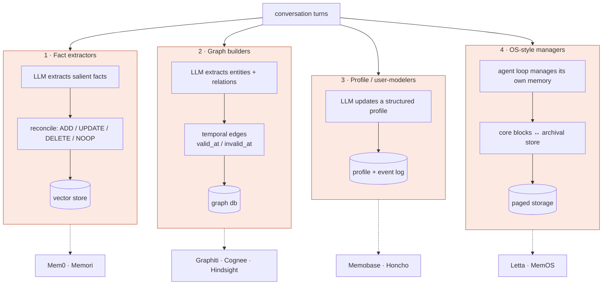
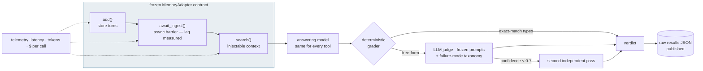
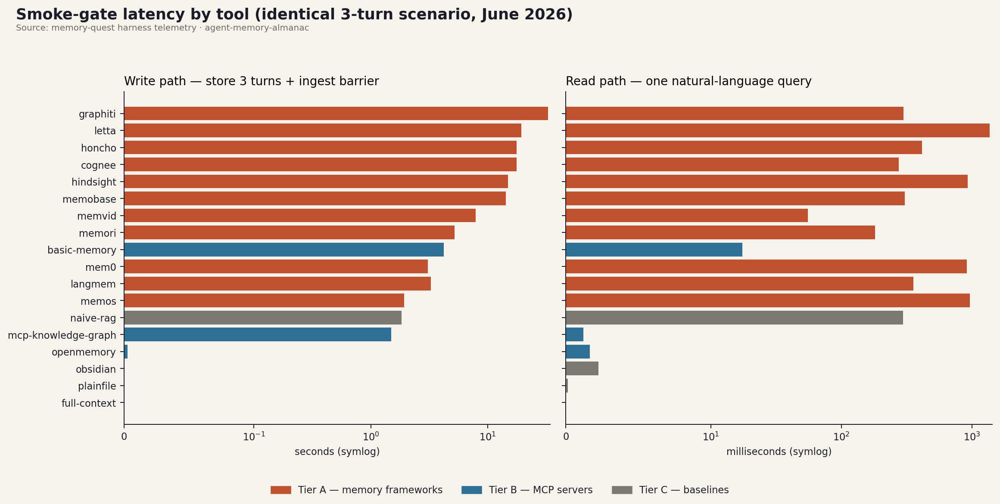

# Architecture atlas

How the agent-memory landscape is shaped, and how the Quest tests it.
(Diagrams render natively on GitHub.)

## The four architectural shapes

Every tool on the roster, whatever its marketing, resolves to one of four
write-path designs — plus the MCP layer that cuts across them:

**Tier B (MCP servers)** — Basic Memory, OpenMemory, mcp-knowledge-graph,
claude-mem — skip the in-tool LLM entirely: *the calling agent* is the
extractor, and the server provides storage + search. Cheap and
client-agnostic, but quality depends on whoever is calling. Memvid is its own
category: an **archive format** (encode corpus → video + index; no
incremental writes).

## How the Quest tests a tool

Same harness for all twenty; the judge was frozen before any tool ran:

The `await_ingest()` barrier is where async-ingestion designs (Graphiti's
graph extraction, Cognee's cognify, Honcho's deriver queue, Memobase's flush,
Memvid's full re-encode) get their cost measured instead of hidden.

## Current readings

